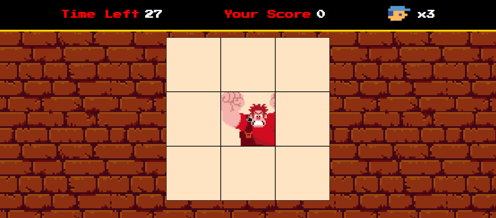

# Game Detona Ralph

  

Esse jogo foi desenvolvido durante o Bootcamp: Potência Tech iFood - Desenvolvimento de Jogos

### Tecnologias Utilizadas

- HTML5 e CSS3:
  - Para a estrutura e aparência do jogo.
- JavaScript:
  - Para a lógica de programação e interatividade.
- Sprites e imagens:
  - Customizadas para criar a estética do jogo.

### Funcionalidades

- **Sistema de Pontuação**: Acompanhe sua pontuação à medida que acerta o alvo.

- **Sistema de Vidas**: Você tem 3 vidas, depois que tiver acabado o seu tempo você perde uma vida, e quando você perder todas as suas 3 vidas o jogo termina.